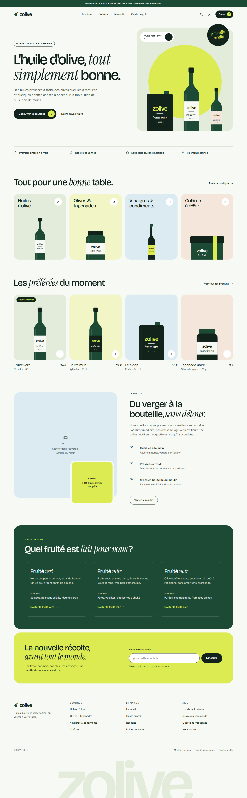

# Zolive

Boutique en ligne d'huiles d'olive et d'épicerie fine. Projet réalisé dans le cadre de mon mastère Lead Développeur (EEMI) ; la marque et le catalogue sont fictifs.

Ce dépôt contient le site et la démarche qui l'encadre : audit de cadrage, décisions d'architecture justifiées, plan de projet agile et guides de méthode.



## État du projet

**Sprint 2 terminé.** Un visiteur parcourt le catalogue en français et en anglais, remplit un panier et possède un compte. Voir les revues et rétrospectives du [sprint 0](docs/project/sprints/sprint-0.md), du [sprint 1](docs/project/sprints/sprint-1.md) et du [sprint 2](docs/project/sprints/sprint-2.md).

| Sprint | Objectif | État |
| --- | --- | --- |
| 0 — Cadrage | Savoir quoi construire, comment, et comment le prouver | Terminé |
| 1 — Fondations et catalogue | Un visiteur parcourt le catalogue en français et en anglais | Terminé |
| 2 — Panier et comptes | Un client remplit un panier et possède un compte | Terminé |
| 3 — Commande | Un client passe commande et la retrouve dans son historique | À venir |
| 4 — Durcissement et audit | Le site tient ses exigences, et je le prouve | À venir |

Suivi : [issues](https://github.com/Benbecker69/zolive_fluide/issues), [jalons](https://github.com/Benbecker69/zolive_fluide/milestones) et tableau du projet.

## Ce que je construis

Une boutique bilingue (français, anglais) : catalogue, panier, compte client, commande avec paiement simulé, historique des commandes. Le site s'exécute en local avec Docker ; il ne traite ni paiement ni donnée réels.

## Pile technique

Next.js 16 (App Router), React 19 et TypeScript 6 sur Node.js 24 LTS ; PostgreSQL 18 avec Drizzle ORM ; Better Auth ; next-intl ; Tailwind CSS 4 ; Vitest et Playwright ; Docker Compose.

Chaque choix est comparé à ses alternatives dans l'[étude technique](docs/audit/03-etude-technique.md) et consigné dans un [ADR](docs/adr/README.md).

## Lire la documentation

| Document | Contenu |
| --- | --- |
| [Audit de cadrage](docs/audit/README.md) | Périmètre, exigences mesurables (performance, sécurité, accessibilité, maintenabilité…), étude technique, risques, plan de l'audit final, sources |
| [Décisions d'architecture](docs/adr/README.md) | Dix ADR : contexte, options, décision, conséquences |
| [Plan de projet](docs/project/plan-de-projet.md) | Organisation agile, feuille de route, *Definition of Ready* et *Done* |
| [Architecture cible](docs/project/architecture.md) | Diagrammes C4, couches, modèle de données, parcours de commande |
| [Backlog](docs/project/backlog.md) | Les issues par sprint, avec priorité et estimation |
| [Guides de méthode](docs/playbooks/README.md) | Ma façon de mener un projet et d'instruire un sujet technique, avec les listes de contrôle |
| [Maquette](design/README.md) | Pages de la maquette, jetons de design, contrastes |
| [Contribuer](CONTRIBUTING.md) | Flux de travail, convention de commits, relecture |

Index complet : [`docs/README.md`](docs/README.md).

## Lancer le site

Dans les deux cas, je pars du fichier d'exemple de configuration :

```bash
cp .env.example .env
```

### En démonstration : Docker seul

Prérequis : Docker. Cette commande construit l'application en mode production, démarre PostgreSQL, applique les migrations, charge le catalogue de démonstration si la base est vide, et attend que l'ensemble soit en bonne santé :

```bash
docker compose --profile demo up --build --wait
```

Le site répond sur `http://localhost:3000` et son état sur `http://localhost:3000/api/health`. Si le port 3000 est déjà pris, je décommente `APP_PORT` dans `.env`. Pour tout arrêter : `docker compose --profile demo down`.

### En développement : rechargement à chaud

Prérequis : Node.js 24 (la version est déclarée dans `.node-version`), pnpm 11 et Docker pour la base.

```bash
pnpm install
pnpm db:up
pnpm db:setup
pnpm dev
```

Le site affiche la page d'accueil (`/fr`, `/en`), la boutique, les fiches produit, le panier (`/fr/panier`) et la charte graphique vivante sur `/fr/styleguide`. Les comptes clients (`/fr/inscription`, `/fr/connexion`, `/fr/compte`) sont en place : profil, adresse de livraison, suppression du compte. Le panier rempli avant la connexion rejoint le compte. La commande et le paiement arrivent au sprint 3. La maquette se consulte en ouvrant les fichiers de [`design/mockup/`](design/mockup/) dans un navigateur.

### Configuration

Toute la configuration passe par des variables d'environnement, décrites dans [`.env.example`](.env.example). L'application les valide au démarrage : s'il en manque une ou si une valeur est invalide, elle s'arrête et nomme la variable en cause, sans jamais afficher sa valeur.

Deux points d'attention : `APP_URL` doit être l'adresse exacte saisie dans le navigateur, et `BETTER_AUTH_SECRET`, qui signe les cookies de session, doit être remplacé par une valeur à vous (`openssl rand -base64 32`).

### Commandes

| Commande | Rôle |
| --- | --- |
| `pnpm dev` | Serveur de développement |
| `pnpm build` | Build de production (le serveur de production se lance par Docker) |
| `pnpm db:up` / `pnpm db:down` | Base PostgreSQL de développement, publiée sur la machine locale uniquement |
| `pnpm db:setup` | Applique les migrations puis charge le catalogue de démonstration |
| `pnpm db:generate` | Génère une migration SQL à partir du schéma (`src/data/schema.ts`) |
| `pnpm test:integration` | Tests d'intégration, sur une base PostgreSQL réelle et dédiée |
| `pnpm demo:up` / `pnpm demo:down` | Profil de démonstration complet |
| `pnpm demo:smoke` | Test de fumée du profil de démonstration |
| `pnpm lint` | Analyse statique, dont la règle de dépendances entre couches |
| `pnpm typecheck` | Vérification des types en mode strict |
| `pnpm test` | Tests unitaires et tests de l'outillage |
| `pnpm e2e` | Tests de bout en bout et d'accessibilité, contre le profil de démonstration démarré |
| `pnpm format` / `pnpm format:check` | Mise en forme du code |
| `pnpm knip` | Détection du code et des dépendances inutilisés |
| `pnpm audit` | Vulnérabilités connues des dépendances, bloquant à partir du niveau « haut » |
| `pnpm check` | Ce que la CI vérifie sur l'application, dans l'ordre |

### Organisation du code

Le code vit dans `src/`, découpé en couches dont les dépendances ne vont que dans un sens : `app` → `features` → `data`, avec `ui`, `i18n` et `lib` en appui. La règle est décrite dans l'[ADR 0002](docs/adr/0002-nextjs-modular-monolith.md), complétée par l'[ADR 0012](docs/adr/0012-i18n-cross-cutting-layer.md), et vérifiée par le linter : une importation qui la viole fait échouer `pnpm lint`.

Les textes de l'interface vivent dans `messages/fr.json` et `messages/en.json`. Le français est la référence : une clé absente en anglais, un texte en dur dans un composant ou une clé inconnue font échouer la CI.
