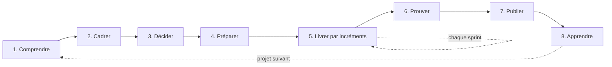

# Mener un projet en tant que lead développeur

Ce guide décrit la manière dont je conduis un projet, de la demande initiale à la version livrée. Je l'ai écrit en menant Zolive, et chaque étape renvoie à ce que j'ai réellement produit. Il est fait pour être réutilisé : les étapes ne dépendent pas de la technologie.

Le fil conducteur tient en une phrase : **je ne code que ce qui a été décidé, je ne décide que ce qui a été compris, et je ne déclare terminé que ce qui a été prouvé.**

## Vue d'ensemble

| Étape | Question | Livrable |
| --- | --- | --- |
| 1. Comprendre | Qu'est-ce qu'on me demande vraiment ? | Liste de questions et réponses |
| 2. Cadrer | Quel périmètre, quelles exigences, quels risques ? | Audit de cadrage |
| 3. Décider | Avec quoi, et pourquoi pas autrement ? | Étude technique, ADR |
| 4. Préparer | Le dépôt est-il prêt à recevoir du code ? | Règles, CI, backlog |
| 5. Livrer | Qu'est-ce qui apporte de la valeur maintenant ? | Incrément à chaque sprint |
| 6. Prouver | Les exigences sont-elles tenues ? | Rapport d'audit |
| 7. Publier | Quelqu'un d'autre peut-il l'utiliser ? | Version, journal, guide d'exploitation |
| 8. Apprendre | Que ferais-je autrement ? | Rétrospective |

## 1. Comprendre la demande

**Objectif.** Réduire l'incertitude avant d'engager du travail. Une heure de questions évite une semaine dans la mauvaise direction.

**Ce que je fais.**

- Je reformule la demande avec mes mots et je la fais valider.
- Je pose toutes les questions dont la réponse change ce que je vais faire, et aucune autre. Ce que je peux vérifier moi-même, je le vérifie au lieu de le demander.
- Je cherche les contraintes cachées : échéance, technologies imposées, hébergement, budget, cadre d'évaluation.
- Je demande ce qui est exclu : le périmètre se définit autant par ses bords que par son centre.

**Sur Zolive.** Avant d'écrire quoi que ce soit, j'ai arrêté par écrit le cadre d'évaluation, l'échéance, le périmètre fonctionnel, la question des comptes clients, les langues, le mode de paiement, l'hébergement et le point de validation avant développement. Ces réponses sont consignées dans [le contexte et le périmètre](../audit/01-contexte-et-perimetre.md).

**Erreurs à éviter.** Supposer au lieu de demander. Demander ce qui se vérifie en trente secondes. Commencer par la solution.

## 2. Cadrer

**Objectif.** Savoir ce qui sera construit, ce qui ne le sera pas, et à quoi on reconnaîtra que c'est bien fait.

**Ce que je fais.**

- Je liste les parties prenantes et ce que chacune attend.
- Je découpe le périmètre et je le priorise en *Must*, *Should*, *Could*, *Won't* [S14]. J'écris les exclusions avec leur raison.
- Je transforme chaque attente de qualité en exigence mesurable : une cible, une méthode de mesure, une source. « Le site doit être rapide » n'est pas une exigence ; « LCP d'au plus 2,5 s mesuré par Lighthouse sur le build de production » en est une.
- Je tiens un registre des risques : probabilité, impact, prévention, signal d'alerte, repli.
- J'écris dès maintenant le plan de l'audit final. Une exigence dont je n'ai pas prévu la mesure ne sera pas mesurée.

**Sur Zolive.** L'[audit de cadrage](../audit/README.md) : 55 exigences identifiées dans huit domaines, 14 risques, et la grille de l'audit final.

**Erreurs à éviter.** Des exigences invérifiables. Une liste de risques sans propriétaire ni signal d'alerte. Un périmètre sans exclusions, qui grossira tout seul.

## 3. Décider

**Objectif.** Choisir les technologies et l'architecture contre les exigences, et garder la trace du raisonnement.

**Ce que je fais.**

- Je fixe les critères de comparaison avant de regarder les options.
- Je compare les options crédibles avec des preuves : documentation officielle, avis de sécurité, registre de paquets, mesures. La méthode détaillée est dans [Traiter un sujet technique](traiter-un-sujet-technique.md).
- J'écris ce que chaque choix coûte. Un choix sans contrepartie est un choix que je n'ai pas étudié.
- Je consigne chaque décision structurante dans un ADR, avant le code [S08], [S09].

**Sur Zolive.** L'[étude technique](../audit/03-etude-technique.md) et les dix [ADR](../adr/README.md).

**Erreurs à éviter.** Choisir par habitude ou par mode. Citer la popularité comme seul argument. Présenter une contrainte comme une conclusion.

## 4. Préparer le terrain

**Objectif.** Faire du bon chemin le chemin le plus facile, avant la première ligne de code.

**Ce que je fais.**

- J'écris les règles de contribution : flux de branches, format des commits, pull requests, relecture, *Definition of Done*.
- Je protège la branche principale : pull request et vérifications obligatoires, pas de poussée directe.
- Je mets la CI en place avant le code qu'elle vérifiera, même si elle ne vérifie d'abord que la documentation.
- J'écris le backlog : des issues avec des critères d'acceptation testables, une priorité, une estimation, rattachées à un sprint.
- Je dessine l'architecture cible pour vérifier que les décisions tiennent ensemble.

**Sur Zolive.** [`CONTRIBUTING.md`](../../CONTRIBUTING.md), la règle de protection de `main`, les modèles d'issues et de pull requests, le [plan de projet](../project/plan-de-projet.md), l'[architecture cible](../project/architecture.md) et les 29 issues du [backlog](../project/backlog.md).

**Erreurs à éviter.** « On ajoutera la CI plus tard. » Des règles écrites que rien ne fait respecter. Un backlog de titres sans critères d'acceptation.

## 5. Livrer par incréments

**Objectif.** Produire à chaque sprint quelque chose qui fonctionne et qui se montre.

**La boucle, pour chaque issue.**

1. Je vérifie que l'issue est prête : critères testables, estimation, dépendances levées.
2. Je crée une branche courte depuis `main` [S02].
3. J'écris le test qui échouera tant que le critère n'est pas rempli, puis le code.
4. Je fais des commits atomiques au format convenu [S04].
5. J'ouvre une pull request liée à l'issue, avec la preuve de vérification.
6. Je relis mon propre diff à froid, avec la liste de contrôle. Le critère est celui des pratiques de Google : la modification améliore-t-elle nettement la santé du code [S07] ?
7. La CI est verte, je fusionne en *squash*, la branche disparaît, l'issue se ferme.

**Le rythme, pour chaque sprint.** Planification avec un objectif, point quotidien, revue sur le build de production, rétrospective avec une action d'amélioration [S01].

**Règles que je m'impose.**

- Une seule issue en cours à la fois.
- Une branche vit de quelques heures à deux jours. Au-delà, l'issue était trop grosse [S03].
- Un *Should* ne démarre pas tant qu'un *Must* du sprint est ouvert.
- Une découverte en cours de route devient une issue, pas un ajout silencieux dans la pull request en cours.

**Erreurs à éviter.** Les pull requests fourre-tout. Le « je testerai après ». Fusionner avec une CI rouge « parce que ça n'a rien à voir ».

## 6. Prouver la qualité

**Objectif.** Remplacer « ça marche » par une mesure qu'un tiers peut refaire.

**Ce que je fais.**

- La qualité est vérifiée en continu : lint, typage, tests, accessibilité et budget de performance bloquent la fusion.
- En fin de projet, je déroule le plan d'audit ligne à ligne sur le build de production.
- Pour chaque exigence : valeur mesurée, statut, preuve conservée dans le dépôt avec la commande, la version de l'outil, la date et le commit.
- Je ne corrige pas pendant l'audit. Un écart devient une issue ; je rejoue l'audit après correction et je garde les deux résultats.
- J'écris les limites de l'audit : ce qu'il ne couvre pas.

**Sur Zolive.** Le [plan de l'audit final](../audit/05-plan-audit-final.md), que je déroulerai au sprint 4.

**Erreurs à éviter.** Mesurer le serveur de développement. Arrondir en sa faveur. Passer sous silence ce qui n'a pas été vérifié.

## 7. Publier

**Objectif.** Rendre la version utilisable par quelqu'un qui n'a pas suivi le projet.

**Ce que je fais.**

- Je numérote la version selon Semantic Versioning [S05] et je tiens le journal des modifications au format Keep a Changelog [S06].
- J'écris le guide d'installation et je le teste sur un poste vierge, montre en main.
- Je mets à jour les ADR, le registre des risques et l'état du projet.

**Erreurs à éviter.** Un README qui ne marche que sur ma machine. Un journal des modifications recopié de l'historique Git sans tri.

## 8. Apprendre

**Objectif.** Que le projet suivant commence plus haut que celui-ci.

**Ce que je fais.** À chaque fin de sprint, puis à la fin du projet : ce qui a marché, ce qui a coincé, ce que je change. Une action à la fois, appliquée au sprint suivant, et dont je vérifie l'effet à la rétrospective d'après.

**Erreurs à éviter.** La rétrospective sautée parce que « tout s'est bien passé ». Dix résolutions dont aucune n'est tenue.

## Ce qui distingue un lead développeur

| Un développeur | Un lead développeur |
| --- | --- |
| Résout le problème posé | Vérifie d'abord que c'est le bon problème |
| Choisit un outil qui marche | Explique pourquoi celui-là, ce qu'il coûte et quand il faudra le revoir |
| Écrit du code qui passe les tests | Définit ce que « terminé » veut dire pour tout le monde |
| Corrige un défaut | Met en place ce qui empêchera le défaut suivant |
| Sait | Écrit, pour que les autres sachent aussi |

## Sources

Les identifiants `[Sxx]` renvoient à la [bibliographie de l'audit](../audit/sources.md).
