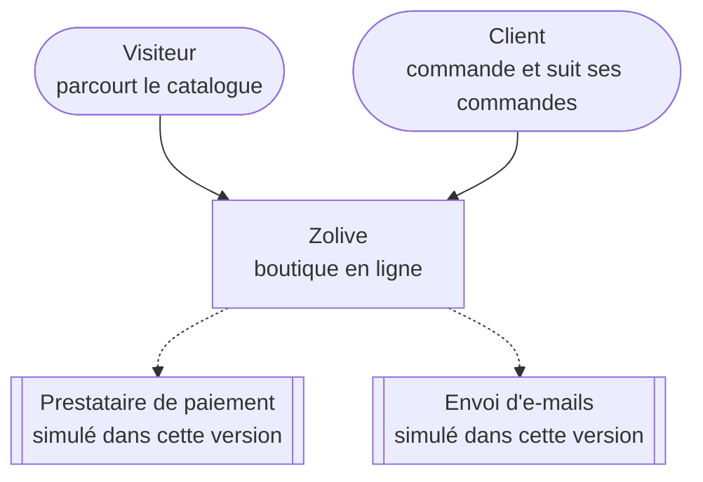
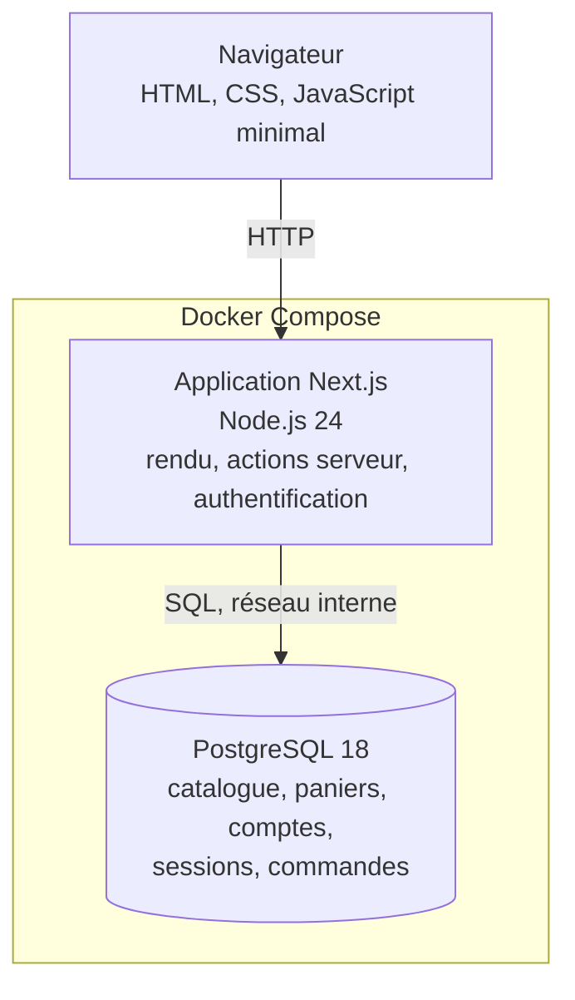
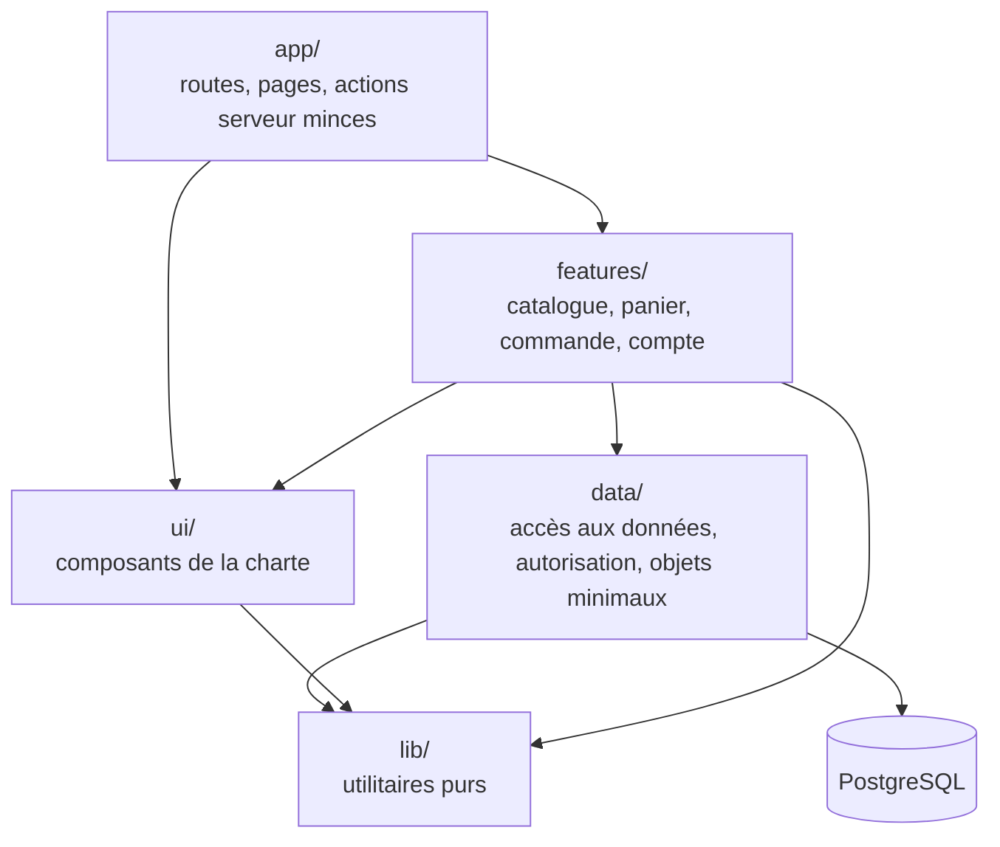
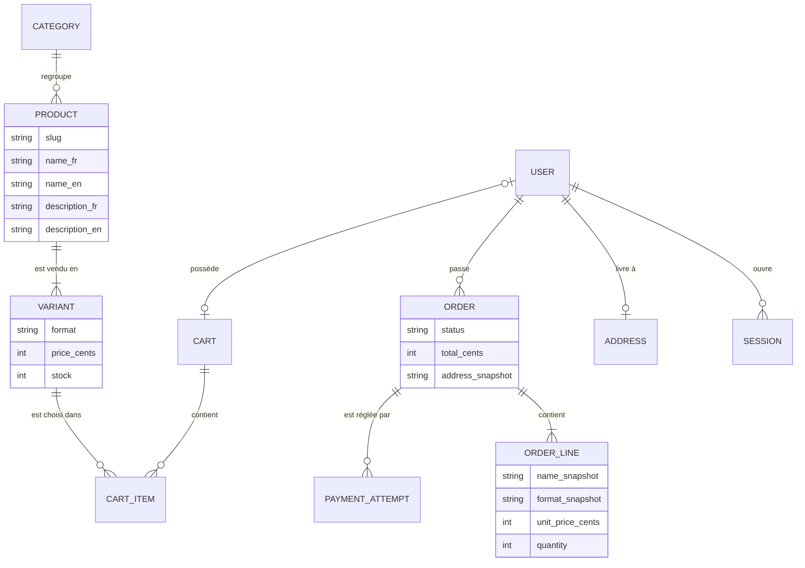
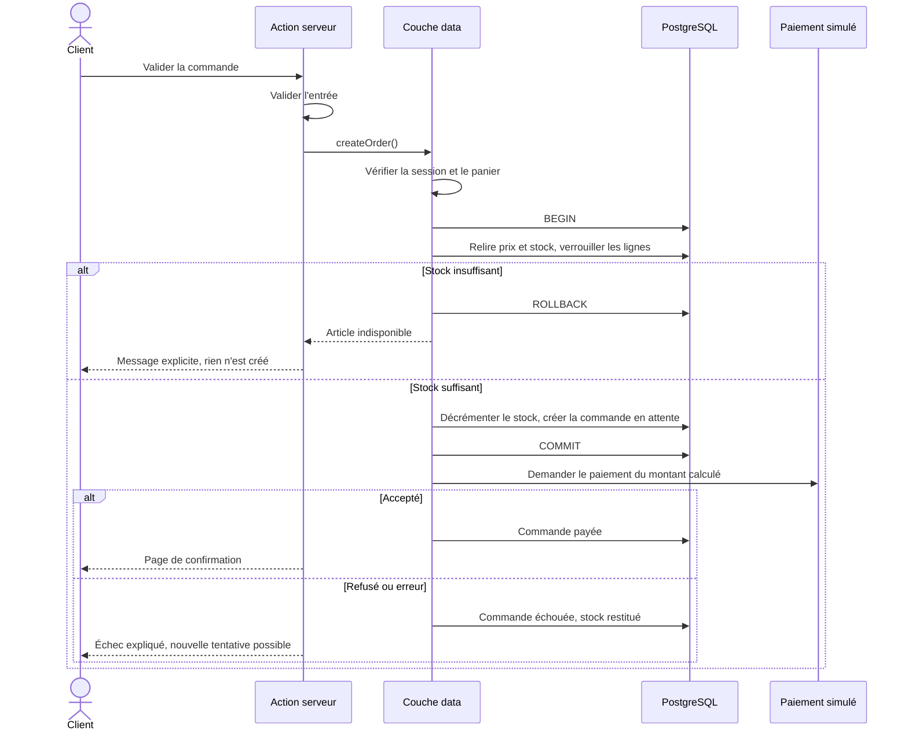

# Architecture cible

Ce document décrit l'architecture que je vise, avant de l'écrire. Il sera tenu à jour au fil des sprints. Les décisions qu'il illustre sont justifiées dans les [ADR](../adr/README.md).

Je représente le système avec les deux premiers niveaux du modèle C4 de Simon Brown : contexte, puis conteneurs [S11]. Le niveau « composants » est donné par le découpage en couches ; je ne documente pas le niveau « code », que le code exprime mieux lui-même.

## Niveau 1 — Contexte

Le système n'a aucune dépendance externe réelle dans cette version : le paiement et l'envoi d'e-mails sont des interfaces servies par des adaptateurs locaux (ADR 0009). Les flèches en pointillé marquent ces points d'extension.

## Niveau 2 — Conteneurs

| Conteneur | Responsabilité | Exposition |
| --- | --- | --- |
| Application Next.js | Sert les pages, exécute les actions serveur, porte l'authentification et les règles métier | Port local uniquement |
| PostgreSQL | Stocke toutes les données ; garantit les contraintes et les transactions | Réseau interne des conteneurs en profil démonstration |

## Découpage en couches

Les dépendances ne vont que dans un sens, du haut vers le bas. Une règle de lint le vérifie (exigence MAINT-01).

| Couche | Contient | Ne contient jamais |
| --- | --- | --- |
| `app/` | Fichiers de route, mises en page, actions serveur qui valident puis délèguent | De requête à la base, de règle métier |
| `features/<domaine>/` | Cas d'usage, composants propres au domaine, schémas de validation | D'import de l'ORM |
| `data/` | Requêtes, transactions, contrôle d'autorisation, objets renvoyés à l'interface ; adaptateurs de paiement et d'e-mail | De composant d'interface ; il est marqué `server-only` |
| `ui/` | Boutons, champs, cartes, en-tête, pied de page, construits sur les jetons | De règle métier, d'accès aux données |
| `lib/` | Formatage, calculs purs, types partagés | D'effet de bord |

### Où se font les contrôles de sécurité

| Contrôle | Couche | Pourquoi là |
| --- | --- | --- |
| Validation des entrées | `features/`, appelée par l'action serveur | Au point d'entrée, avant tout traitement |
| Authentification et autorisation | `data/` | Au plus près de la donnée : aucun chemin d'accès ne peut l'éviter (SEC-01) |
| Redirections de confort, routage par langue | `proxy.ts` | Jamais un contrôle d'accès |
| Calcul des prix et des totaux | `data/`, à partir de la base | Le client n'est jamais cru (SEC-07) |

## Modèle de données

Modèle conceptuel de départ ; le schéma exact sera fixé par les migrations.

Trois choix de modélisation portent des exigences.

- **Les prix sont des entiers, en centimes.** Aucun calcul monétaire en nombre flottant.
- **Une commande copie ce qu'elle vend.** Nom, format, prix unitaire et adresse sont recopiés dans la commande : modifier le catalogue ne réécrit pas l'histoire.
- **Le stock ne peut pas devenir négatif.** C'est une contrainte de la base, pas seulement une vérification applicative : elle tient même en cas de commandes simultanées.

## Parcours critique : valider une commande

Ce diagramme est le contrat que les tests d'intégration de la commande vérifieront, cas par cas (ADR 0007).

## Stratégie de rendu

| Pages | Rendu | Raison |
| --- | --- | --- |
| Accueil, boutique, fiche produit, pages légales | Statique, régénéré quand le catalogue change | Performance (PERF-01 à PERF-04) |
| Panier | Dynamique | Dépend du visiteur |
| Compte, tunnel de commande, historique | Dynamique, authentifié | Données personnelles ; CSP stricte à *nonces* (SEC-09) |

Le compteur du panier dans l'en-tête est la seule partie dynamique des pages publiques. Je le charge à part pour ne pas rendre toute la page dynamique : un petit composant client l'obtient par une requête propre au visiteur, une fois la page affichée, puis à chaque modification du panier. Sans JavaScript, le lien vers le panier reste présent, sans son compteur.

## Le panier à la connexion

Un panier appartient à qui présente son identifiant, tiré du cookie du visiteur. À la connexion ou à l'inscription, je le rattache au compte, avec au plus un panier par compte, garanti par une contrainte d'unicité en base.

| Situation à la connexion | Résultat |
| --- | --- |
| Panier invité, compte sans panier | Le panier invité devient celui du compte |
| Panier invité et panier du compte | Les lignes sont additionnées, chaque quantité plafonnée par le stock et par la limite par ligne, puis le panier invité est supprimé |
| Pas de panier invité | L'appareil retrouve le panier du compte |

Trois règles encadrent ce passage :

- l'identifiant du compte vient de l'authentification qui vient de réussir, jamais du navigateur ;
- seul un panier sans propriétaire peut être repris : présenter l'identifiant du panier d'un autre compte ne donne rien ;
- à la déconnexion, le cookie est retiré : le panier reste attaché au compte et n'est plus accessible depuis l'appareil, ce qui compte sur un poste partagé.

Le domaine `compte` appelle ici le domaine `panier`, et jamais l'inverse.

## La suppression du compte

Le client supprime son compte depuis la page du compte, en confirmant avec son mot de passe (exigence LEG-06). La page annonce avant la confirmation ce qui est supprimé et ce qui est conservé.

| Donnée | Sort | Mécanisme |
| --- | --- | --- |
| Nom, adresse e-mail, mot de passe haché | Supprimés | Suppression de l'utilisateur et de ses identifiants |
| Sessions, sur tous les appareils | Supprimées | Clé étrangère en cascade |
| Adresse de livraison | Supprimée | Clé étrangère en cascade |
| Panier enregistré | Supprimé | Clé étrangère en cascade |
| Compteur de tentatives de connexion | Supprimé | Remise à zéro après la suppression |
| Journaux de sécurité | Conservés | Ils ne contiennent ni nom, ni adresse e-mail, ni mot de passe |

Les commandes n'existent pas encore : leur conservation sans identifiant personnel est traitée avec leur création, au sprint 3.

Trois règles encadrent cette action :

- le compte supprimé est celui de la session, jamais un identifiant reçu du navigateur (SEC-01) ;
- la fonction de la couche `data` refuse un mot de passe vide avant d'appeler la bibliothèque d'authentification. En lisant son code, j'ai constaté qu'elle ne vérifie le mot de passe que s'il est fourni, et qu'elle accepte sinon une session récente seule. Un test d'intégration verrouille ce refus ;
- un mot de passe erroné compte comme un échec de connexion du compte (ADR 0014) : une session laissée ouverte ne permet donc pas de deviner le mot de passe sans limite.

## Sources

Les identifiants `[Sxx]` renvoient à la [bibliographie de l'audit](../audit/sources.md).
