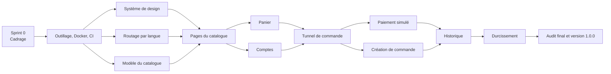

# Plan de projet

L'[audit de cadrage](../audit/README.md) dit ce que je construis et les [ADR](../adr/README.md) disent comment. Ce document dit dans quel ordre, à quel rythme, et à quoi je reconnais qu'un travail est terminé.

## Mon cadre de travail : Scrum, adapté à une personne

Je m'appuie sur le Scrum Guide de 2020 [S01]. Scrum prévoit trois responsabilités, cinq événements et trois artefacts ; il est conçu pour une équipe. Je suis seul : je garde donc ce qui sert l'inspection et l'adaptation, et je dis clairement ce que j'adapte. Ce que je pratique est un Scrum allégé, pas Scrum au sens strict.

### Responsabilités

| Responsabilité Scrum | Qui | Comment je la tiens |
| --- | --- | --- |
| *Product Owner* | Moi | J'ordonne le backlog et je décide du périmètre dans les issues, jamais au milieu d'une pull request |
| *Developers* | Moi | Je réalise l'incrément et je respecte la *Definition of Done* |
| *Scrum Master* | Moi | Je protège le cadre : pas de travail sans issue, rétrospective tenue même si le sprint s'est bien passé |

Tenir trois rôles seul comporte un risque : l'arbitre et le joueur ont le même intérêt à trouver que « c'est bon ». Ma parade est de rendre les décisions vérifiables par un tiers : critères d'acceptation écrits avant le code, CI bloquante, preuves dans les pull requests.

### Événements

| Événement Scrum | Ce que je fais | Trace laissée |
| --- | --- | --- |
| Sprint | Une semaine, à durée fixe. Scrum demande un mois au plus [S01] ; je choisis court pour avoir un retour rapide | Jalon GitHub |
| *Sprint Planning* | En début de sprint : je fixe l'objectif, je choisis les issues selon la vélocité mesurée, je vérifie qu'elles sont prêtes | Objectif écrit dans la description du jalon |
| *Daily Scrum* | Chaque jour de travail, cinq minutes : où j'en suis par rapport à l'objectif, ce qui me bloque | Tableau du projet à jour ; étiquette `blocked` si besoin |
| *Sprint Review* | En fin de sprint : je déroule les parcours sur le build de production et je compare aux critères d'acceptation | Compte rendu dans `docs/project/sprints/` |
| *Sprint Retrospective* | Après la revue : ce qui a marché, ce qui a coincé, une action d'amélioration au plus, que j'applique au sprint suivant | Même compte rendu |

### Artefacts et engagements

| Artefact | Engagement associé [S01] | Où il vit |
| --- | --- | --- |
| *Product Backlog* | Objectif de produit : une boutique où un client commande et retrouve sa commande, en deux langues, avec une qualité prouvée | [Issues GitHub](https://github.com/Benbecker69/zolive_fluide/issues), récapitulées dans le [backlog](backlog.md) |
| *Sprint Backlog* | Objectif de sprint | Issues du jalon, suivies sur le tableau du projet |
| Incrément | *Definition of Done* | Branche `main`, toujours livrable |

## Du besoin à l'issue

### Format d'une *user story*

Chaque fonctionnalité est une issue rédigée du point de vue de l'utilisateur, avec des critères d'acceptation testables au format « étant donné, quand, alors ». Je vérifie chaque story avec les critères INVEST de Bill Wake : indépendante, négociable, porteuse de valeur, estimable, petite, testable [S13].

### Priorisation

J'utilise MoSCoW [S14]. Répartition de l'effort estimé du backlog :

| Priorité | Points | Part |
| --- | --- | --- |
| Must | 111 | 87 % |
| Should | 9 | 7 % |
| Could | 7 | 6 % |
| **Total** | **127** | 100 % |

**Je suis au-dessus de la recommandation du cadre DSDM**, qui conseille de limiter les *Must* à environ 60 % de l'effort pour garder une marge [S14]. Je l'assume pour deux raisons, et j'en tire une règle.

- Le périmètre a déjà été réduit en amont : paiement réel, administration et mise en ligne sont exclus. Ce qui reste en *Must* est le minimum pour qu'un client commande de bout en bout.
- La règle des 60 % protège une échéance fixe. La mienne est proche mais non bloquante : ma variable d'ajustement est le temps, pas le périmètre *Must*.
- Règle : un *Should* ou un *Could* ne démarre que si tous les *Must* du sprint sont terminés. Si la vélocité réelle est inférieure à la prévision, ce sont eux qui sortent en premier (risques R-10 et R-13).

### Estimation

J'estime en points d'histoire sur la suite 1, 2, 3, 5, 8, par comparaison entre stories et non en heures. Une story estimée à 13 est trop grosse : je la découpe avant de la prendre.

La répartition par sprint ci-dessous était une **hypothèse de départ**. La vélocité mesurée est de 35 points au sprint 1 et de 30 points au sprint 2, soit 32,5 en moyenne ; je l'utilise comme plafond pour les sprints suivants, avec les réserves notées dans les revues du [sprint 1](sprints/sprint-1.md) et du [sprint 2](sprints/sprint-2.md).

### *Definition of Ready*

Je ne prends une issue dans un sprint que si :

- elle a un énoncé de valeur ou un contexte clair ;
- elle a des critères d'acceptation testables ;
- elle cite les exigences de l'audit qu'elle touche ;
- elle est estimée, à 8 points au plus ;
- elle ne dépend d'aucune issue non terminée, ou la dépendance est planifiée avant elle ;
- chacun de ses critères est démontrable avec ce qui existe déjà sur `main` (ajout de la rétrospective du sprint 1).

### *Definition of Done*

La définition complète est dans [`CONTRIBUTING.md`](../../CONTRIBUTING.md). En résumé : critères d'acceptation démontrés, tests au bon niveau, CI verte, aucune régression sur les seuils de l'audit, textes dans les deux langues, documentation et ADR à jour, pull request fusionnée.

## Feuille de route

| Sprint | Objectif | Points prévus | Ce que je montre en revue |
| --- | --- | --- | --- |
| 0 — Cadrage | Savoir quoi construire, comment, et comment le prouver | — | Audit, ADR, backlog, guides de méthode |
| 1 — Fondations et catalogue | Un visiteur parcourt le catalogue en français et en anglais | 35 | Accueil, boutique, fiche produit, sur le build Docker ; CI complète |
| 2 — Panier et comptes | Un client remplit un panier et possède un compte | 24 *Must* + 6 *Should* | Ajout au panier, inscription, connexion, page de compte |
| 3 — Commande | Un client passe commande et la retrouve dans son historique | 29 | Tunnel complet, paiement simulé accepté et refusé, historique |
| 4 — Durcissement et audit | Le site tient ses exigences, et je le prouve | 23 *Must* + 3 *Should* + 7 *Could* | Rapport d'audit final, version 1.0.0 |

Le détail des issues par sprint est dans le [backlog](backlog.md).

### Ordre et dépendances

Trois règles d'ordonnancement découlent de ce schéma.

1. **L'outillage avant la première fonctionnalité.** La première issue du sprint 1 monte toute la chaîne sur un squelette vide, pour découvrir les incompatibilités de versions avant qu'elles ne coûtent cher (risque R-03).
2. **La qualité dès le premier composant.** L'accessibilité et les tests ne sont pas un sprint à part : ils sont dans la *Definition of Done*. Le sprint 4 sert à durcir et à mesurer, pas à rattraper.
3. **Le sprint 4 n'est jamais sacrifié.** Si je prends du retard, je réduis le périmètre fonctionnel, pas l'audit.

## Suivi et pilotage

| Question | Où je regarde | Fréquence |
| --- | --- | --- |
| Où en est le sprint ? | Tableau du projet : *Todo*, *In Progress*, *Done* | Chaque jour |
| Vais-je tenir l'objectif ? | Points terminés rapportés aux points prévus du jalon | Milieu et fin de sprint |
| La qualité tient-elle ? | Vérifications de la CI sur chaque pull request | À chaque pull request |
| Les risques ont-ils bougé ? | [Registre des risques](../audit/04-risques.md) | Fin de sprint |
| Mes décisions sont-elles à jour ? | [Index des ADR](../adr/README.md) | À chaque décision structurante |

Je limite le travail en cours à **une issue à la fois**. Seul, ouvrir deux branches en parallèle ne fait qu'allonger leur durée de vie, ce qui va contre les branches courtes que je vise (ADR 0008).

## Comptes rendus de sprint

À la fin de chaque sprint, j'ajoute un fichier `docs/project/sprints/sprint-N.md` : objectif, points prévus et terminés, démonstration, écarts, risques mis à jour, et l'action d'amélioration retenue en rétrospective. Le compte rendu du sprint 0 sera écrit à la clôture du cadrage.

## Sources

Les identifiants `[Sxx]` renvoient à la [bibliographie de l'audit](../audit/sources.md).
